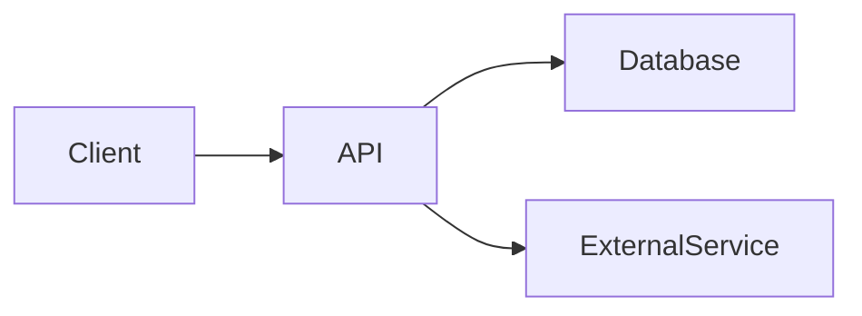

# Skill: Professional GitHub README Generator

## Purpose

Generate a professional, recruiter-friendly, and developer-friendly `README.md` for a software project.

The README should be clear, concise, technically accurate, and suitable for GitHub repositories and open-source projects.

## Required Behavior

Before generating the README:

1. Analyze the available project information, including:
   - Project files
   - Folder structure
   - `package.json`, `requirements.txt`, `Dockerfile`, etc.
   - Configuration files
   - Existing documentation
   - APIs and external services
   - Deployment configuration
2. Do **not invent project details**.
3. If important information is unavailable, omit that section.
4. **Ask for the author's name if it has not been provided.**
5. If portfolio, GitHub, LinkedIn, or other author links are not provided, omit them rather than inventing them.
6. After collecting the required information, generate the complete README in Markdown.

### Author Question

If the author's name is unknown, ask:

> What name should I use for the README author?  
> You can also provide your Portfolio, GitHub, and LinkedIn links if you want them included.

Do not generate the final README until the author name is provided.

---

# README Structure

Generate the README using the following structure where applicable.

## 1. Project Title

Use a clear and descriptive project name.

## 2. Short Description

Explain what the project does in 2–3 sentences.

Focus on:
- The problem it solves
- What the application provides
- Its primary use case

## 3. Demo

Include available:
- Screenshots
- GIFs
- Video
- Live demo URL

If no demo is available, omit this section.

## 4. Features

List the main features using concise bullet points.

Example:

- User authentication and authorization
- Real-time communication
- Persistent data storage
- Responsive UI
- Error handling and validation

Only include features actually present in the project.

## 5. Tech Stack

List the technologies, frameworks, libraries, databases, infrastructure, and services used.

Group them logically where useful.

Example:

- **Frontend:** React, TypeScript, Tailwind CSS
- **Backend:** Node.js, Express
- **Database:** PostgreSQL
- **Authentication:** JWT
- **DevOps:** Docker, GitHub Actions

## 6. Architecture

Include this section when the project has enough complexity to benefit from an architecture explanation.

Prefer a Mermaid diagram when appropriate.

Example:



Keep the diagram simple and ensure it accurately represents the actual project.

## 7. Project Structure

Show the relevant folder structure.

Example:

```text
project/
├── frontend/
│   ├── src/
│   └── package.json
├── backend/
│   ├── src/
│   └── package.json
├── docker-compose.yml
└── README.md
```

Do not include every generated or irrelevant file.

## 8. Installation

Provide clear steps for setting up the project locally.

Include:

1. Clone the repository
2. Enter the project directory
3. Install dependencies
4. Configure environment variables
5. Start required services
6. Run the application

Use commands that match the actual project.

Example:

```bash
git clone <repository-url>
cd <project-directory>

npm install
```

Never invent repository URLs.

## 9. Environment Variables

List all required environment variables.

Use a table when appropriate:

| Variable | Description | Required |
|---|---|---|
| `DATABASE_URL` | Database connection string | Yes |
| `JWT_SECRET` | Secret used for authentication tokens | Yes |
| `API_KEY` | External API key | Yes |

Do not expose actual secrets.

## 10. Usage

Explain how to run and use the application locally.

Include relevant commands such as:

```bash
npm run dev
```

or:

```bash
docker compose up
```

Only include commands supported by the project.

## 11. Automation

If applicable, document:

- GitHub Actions
- CI/CD pipelines
- Cron jobs
- Scheduled tasks
- Background workers
- Automated deployments
- Database migrations

If the project has no meaningful automation, omit this section.

## 12. Example Output

Show a representative example of the application's output.

This may include:

- API response
- CLI output
- UI result
- JSON response
- Screenshot reference

Do not fabricate output that the application does not produce.

## 13. Configuration

Explain important configurable settings.

Examples:

- Application configuration files
- Docker configuration
- Database settings
- API configuration
- Feature flags
- Build configuration

Only include configuration relevant to the project.

## 14. APIs & External Services

List external APIs and services used by the application.

For each service, briefly explain its purpose.

Examples:

- OpenAI API — AI-powered responses
- Cloudinary — Image storage
- Redis — Caching/session management
- PostgreSQL — Persistent data storage

Do not claim that an API or service is used unless project evidence supports it.

## 15. Roadmap / Future Improvements

Include planned improvements as a checklist.

Example:

- [ ] Add social authentication
- [ ] Improve test coverage
- [ ] Add rate limiting
- [ ] Add automated deployment
- [ ] Improve accessibility

Only include reasonable future improvements. Clearly distinguish them from existing features.

## 16. Contributing

Provide a short contribution guide.

Example:

```text
1. Fork the repository
2. Create a feature branch
3. Make your changes
4. Commit your changes
5. Open a pull request
```

If the repository has specific contribution rules, follow those instead.

## 17. License

Include the project's actual license.

If no license is specified in the project, omit this section rather than assuming one.

## 18. Author

Use the author's information provided by the user.

Example:

```markdown
## Author

**Vishesh Verma**

- Portfolio: <portfolio-url>
- GitHub: <github-url>
- LinkedIn: <linkedin-url>
```

### Important

Never invent the author's name.

If the author name is missing, ask the user:

> What name should I use for the README author?

If links are not provided, omit them.

## 19. Badges

Add useful badges when relevant.

Possible badges include:

- Build status
- License
- GitHub stars
- Last commit
- Version
- Deployment status
- Tech stack

Do not add meaningless or broken badges.

## 20. Acknowledgements

Include credits for:

- Libraries
- Frameworks
- APIs
- Open-source projects
- Tutorials
- People
- Other resources

Only include acknowledgements supported by the project information.

---

# Writing Guidelines

- Use professional English.
- Keep the README concise but informative.
- Use Markdown headings consistently.
- Use code blocks for commands and configuration.
- Use tables when they improve readability.
- Use emojis sparingly.
- Prefer technical clarity over marketing language.
- Make the README understandable to both recruiters and developers.
- Do not exaggerate project capabilities.
- Do not invent missing information.
- Do not expose secrets, API keys, passwords, or private credentials.
- Use Mermaid diagrams only when they genuinely improve understanding.
- Keep examples representative of the actual project.
- Avoid unnecessary sections when information is unavailable.

# Final Validation

Before returning the README, verify:

- [ ] Project title is accurate
- [ ] Description reflects the actual project
- [ ] Features are based on the project
- [ ] Tech stack is accurate
- [ ] Architecture matches the implementation
- [ ] Project structure matches the repository
- [ ] Installation commands are correct
- [ ] Environment variables are complete
- [ ] Usage instructions are correct
- [ ] External services are accurately listed
- [ ] No secrets are exposed
- [ ] Author name was explicitly provided by the user
- [ ] Author links are not invented
- [ ] License is not invented
- [ ] No unsupported claims were added
- [ ] Markdown formatting is valid

# Output

Return only the completed `README.md` content after all required information has been collected.

If the author's name is missing, **do not generate the README yet. Ask for the author's name first.**