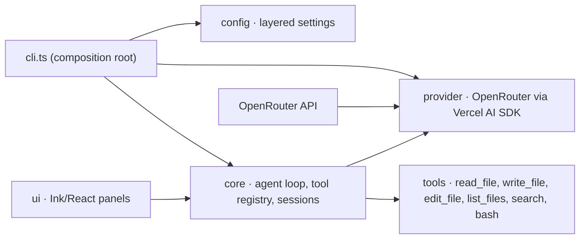

# ViCode

An interactive terminal AI coding agent that lets you chat with an LLM directly inside your project directory. ViCode can read, write, and edit files, search your codebase, and run shell commands — all from a two-panel TUI built with Ink (React for CLIs).

Think of it as a Claude Code / OpenCode-style assistant that runs on Bun, streams responses token-by-token, and asks for your approval before executing dangerous actions.

## Features

- **Two-panel terminal UI** — live chat panel plus a usage panel showing model, token count, context window usage, cost, and turn count
- **Manual ReAct agent loop** — agent reasons, calls tools, observes results, and repeats until it's done; you see every step as it happens
- **Six core tools** — `read_file`, `list_files`, `search`, `write_file`, `edit_file`, `bash`
- **Streaming responses** — token-by-token output with Escape to cancel an in-progress response
- **Approval-based safety** — sensitive files (`.env*`, keys, credential stores, `.ssh/**`) are protected from reads and require approval for writes/edits; every `bash` call requires your approval
- **Doom-loop detection** — repeated identical tool calls are detected and stopped automatically
- **Slash commands** — `/help`, `/model`, `/skill`, `/session`, `/new`, `/exit` with command suggestions as you type
- **Skills** — activate Markdown skill files that are injected as extra system-prompt layers
- **Session persistence** — conversations auto-save as JSON per project and can be resumed via `/session`
- **Token & cost tracking** — live usage in the status bar and a full session summary on exit
- **Layered configuration** — project config overrides global config; OpenRouter API key from config or `OPENROUTER_API_KEY`
- **Codebase-inline diffs** — file changes render as colored unified diffs right in the chat flow
- **Terminal-friendly input** — mouse-wheel scrolling, page up/down, `@` file mentions, and context-budgeted prompts

## Tech Stack

- **Runtime:** Bun
- **Language:** TypeScript (strict)
- **UI:** Ink 7, React 19, `@inkjs/ui`, `chalk`
- **LLM integration:** Vercel AI SDK (`ai`) + `@openrouter/ai-sdk-provider`
- **Validation:** Zod
- **Diffing:** `diff`
- **Testing:** Bun's built-in test runner (`bun test`)

## Architecture

The codebase is organized into four layers with clear dependency boundaries. The innermost `core` layer depends only on Zod; `config`, `providers`, `tools`, and `ui` each depend on `core` but never on each other. `src/cli.ts` is the composition root that wires everything together.



The agent loop (`src/core/agent-loop.ts`) is a manual ReAct loop: it streams text and tool-call events from the provider, checks each tool against the approval policy, executes approved calls, feeds results back into the conversation, and repeats until the model stops calling tools.

## Project Structure

```text
vicode/
├── index.ts                  # Dev entry point → src/cli.ts
├── package.json              # Built for npm; "vicode" bin entry (dist/index.js)
├── scripts/build.ts          # Production build → dist/index.js (Node ESM bundle)
├── tsconfig.json
├── src/
│   ├── cli.ts                # Entry point: wires config → provider → core → UI
│   ├── core/                 # Agent loop, tool registry, sessions, skills, pricing, prompts
│   ├── config/               # Layered config loading + CLI arg parsing
│   ├── providers/            # OpenRouter provider (Vercel AI SDK)
│   ├── tools/                # read_file, list_files, search, write_file, edit_file, bash
│   ├── commands/             # /help, /model, /skill, /session, /new, /exit
│   └── ui/                   # Ink React components (app, panels, picker, theme, mouse)
├── tests/                    # Mirrors src/ (core, config, commands, tools, ui; uses @/ alias)
├── SPEC.md                   # Full product spec and design decisions
├── GLOSSARY.md               # Domain glossary
└── AGENTS.md                 # Agent skills (issue tracker, labels, domain docs)
```

## Installation

Install globally (works with `npm`, `bun`, `yarn`, or `pnpm`):

```bash
npm install -g vicode-ai
# or
bun add -g vicode-ai
# or
yarn global add vicode-ai
# or
pnpm add -g vicode-ai
```

Or run it without installing:

```bash
npx vicode-ai
# or
bunx vicode-ai
# or
pnpm dlx vicode-ai
```

Run it in your current directory (local install):

```bash
npm install vicode-ai
npx vicode
```

### Development

Building the CLI requires [Bun](https://bun.com). To run from source:

```bash
git clone https://github.com/Vishesh-Verma-07/ViCode.git
cd ViCode

bun install
bun run index.ts
```

## Configuration

ViCode reads a layered configuration (project wins over global):

1. **Project:** `.vicode.json` in your project root
2. **Global:** `~/.vicode/config.json`
3. **Fallback:** the `OPENROUTER_API_KEY` environment variable (a `.env` file in the project root is loaded as well)

```json
{
  "apiKey": "your-openrouter-key",
  "model": "deepseek/deepseek-v4-flash-0731:free",
  "systemPrompt": "Optional extra system prompt text or path to a .md file",
  "sensitiveFiles": ["extra-patterns/**.env.custom"]
}
```

| Key | Description | Required |
|---|---|---|
| `apiKey` | OpenRouter API key | Yes |
| `model` | LLM model identifier (e.g., `anthropic/claude-sonnet-4`) | No |
| `systemPrompt` | Extra system prompt text or path to a Markdown file | No |
| `sensitiveFiles` | Extra glob patterns treated as sensitive paths | No |

Sensitive paths are matched by default against `.env*`, `*.pem`, `*.key`, `id_rsa*`, `.git-credentials`, and `.ssh/**`, plus any patterns you add.

## Usage

Start ViCode in your current directory:

```bash
vicode
# or
bun run index.ts
```

Start in a specific directory:

```bash
vicode ./my-project
```

Once running, just type a message. The agent reads files, searches your code, edits, and runs commands, showing you diffs inline and asking for approval (`y`/`n`) before dangerous operations.

### Slash Commands

| Command | Description |
|---|---|
| `/help` | List available commands |
| `/model` | Switch LLM model mid-session (from OpenRouter's model list) |
| `/skill` | Load a skill Markdown file as a system-prompt layer |
| `/session` | List or resume saved sessions |
| `/home` | Return to the welcome screen |
| `/new` | Save the current session and start fresh |
| `/exit` | Exit ViCode |

### Key Shortcuts

| Key | Action |
|---|---|
| `Esc` | Cancel the in-progress LLM response |
| `y` / `n` | Approve / reject a pending tool call |
| `Ctrl+C` | Show the session summary and exit |
| `PageUp` / `PageDown` | Scroll chat history |
| `End` | Return to the bottom of the chat |
| Mouse wheel | Scroll chat history |

## Environment Variables

| Variable | Description | Required |
|---|---|---|
| `OPENROUTER_API_KEY` | OpenRouter API key (fallback if not in config) | Yes (via config or this variable) |

Get a key at <https://openrouter.ai/keys>.

## Example Session

```text
You: What does the bash tool do in this project?

vicode: Let me check the tool implementation...

vicode: 🔧 bash — { command: "cat src/tools/bash.ts" }

vicode: The bash tool executes a shell command via Bun.spawn and
       captures stdout/stderr, with a configurable timeout
       (default 30s) and a 1MB output cap. It's marked dangerous,
       so every call requires your approval before running.

Tokens: 1,234 | Cost: $0.00012
```

## APIs & External Services

| Service | Purpose |
|---|---|
| [OpenRouter](https://openrouter.ai) | LLM inference gateway — ViCode routes all model calls through OpenRouter's API and uses its model list and usage metadata for `/model` and cost tracking |

## Testing

Run the test suite with Bun's built-in test runner:

```bash
bun test
```

Tests live in a top-level `tests/` tree that mirrors `src/` (e.g. `tests/core/agent-loop.test.ts`), importing source through the `@/` path alias. They cover the provider seam, tool execution, config layering, session persistence, the agent loop, and UI components via `ink-testing-library`.

## Roadmap / Future Improvements

- [ ] Add more LLM providers (the `Provider` interface is provider-agnostic)
- [ ] MCP (Model Context Protocol) tool support via the tool registry
- [ ] Multi-file atomic edit operations
- [ ] Context window compaction / summarization for long sessions
- [ ] Dedicated git integration UI
- [ ] Theme system (config already reserves a `theme` field)

## Contributing

1. Fork the repository
2. Create a feature branch
3. Make your changes (keep `core` free of UI/provider imports)
4. Add tests for new behavior and run `bun test`
5. Commit your changes
6. Open a pull request

## Author

**Vishesh Verma**

- GitHub: [Vishesh-Verma-07](https://github.com/Vishesh-Verma-07)