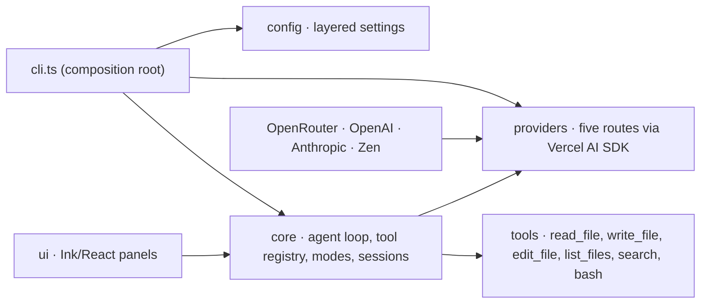

# ViCode

An interactive terminal AI coding agent. ViCode chats with an LLM directly inside your project directory: it reads, writes, and edits files, searches your codebase, and runs shell commands — all from a two-panel TUI built with Ink (React for CLIs).

Think of it as a Claude Code / OpenCode-style assistant that streams responses token-by-token, scopes what the model is allowed to touch, and asks for your approval only when a call actually reaches outside the blast radius.

```bash
npm install -g vicode-ai
vicode
```

## Contents

- [Features](#features)
- [Requirements](#requirements)
- [Installation](#installation)
- [Configuration](#configuration)
- [Modes](#modes)
- [Slash commands](#slash-commands)
- [Key shortcuts](#key-shortcuts)
- [How approval works](#how-approval-works)
- [Context window and compaction](#context-window-and-compaction)
- [On-disk layout](#on-disk-layout)
- [Usage](#usage)
- [Tech stack](#tech-stack)
- [Architecture](#architecture)
- [Project structure](#project-structure)
- [Development](#development)
- [Testing](#testing)
- [Known limitations](#known-limitations)
- [Roadmap](#roadmap)
- [Contributing](#contributing)

## Features

**Interface**

- **Two-panel terminal UI** — a scrolling Chat Panel plus a Usage Panel showing the live route, token totals (in/out), context-window usage, cost, and turn count
- **Seven-state Turn Status** — idle, thinking, running a tool, waiting for approval, compacting, done (with elapsed time), or errored
- **Cursor-aware input** — left/right arrows move by grapheme cluster, so ZWJ emoji and combining marks behave as one character; word-delete works mid-word and at boundaries
- **Input History** — every input you submit is recalled into the draft with Up/Down; recalled inputs are drafts, not replays
- **Command Suggestion** — a filtered dropdown above the input as you type after `/`, with arrow-key selection and `Enter` to accept
- **Cursor-aware Welcome Screen** — edit your first message with the same editing primitives before you send it
- **Terminal-friendly navigation** — mouse-wheel scrolling, PageUp/PageDown, End to jump to the bottom, and a `↑ N lines — End to return` hint when you're scrolled up

**Agent**

- **Manual ReAct loop** — the agent reasons, calls tools, observes results, and repeats until it's done; you see every step as it happens
- **Modes** — `build`, `discuss`, and `plan` scope which tools the model can even see, and layer their own instructions on top of the System Prompt; all three are listed in the Mode Switcher inside the Input Box, with the active one tagged in its own color
- **Six core tools** — `read_file`, `list_files`, `search`, `write_file`, `edit_file`, `bash`
- **Streaming responses** — token-by-token output; `Esc` cancels an in-progress response
- **Doom-loop detection** — three identical tool calls in a row (compared on key-sorted arguments) are detected and the turn is stopped
- **Codebase-inline diffs** — file changes render as colored unified diffs with old/new line numbers, right in the chat flow
- **Token & cost tracking** — live usage in the Usage Panel and Status Bar, plus a session summary on exit

**Safety**

- **Path-scoped approval** — normal in-project file operations run silently; approval is requested only for Sensitive Paths and for anything outside the Project Root
- **Turn-scoped approval memory** — approve a path once and later calls to that same path in the same turn run without re-asking
- **Bash Allowlist** — opt read-only commands into silent execution; everything else pauses for approval on every single call
- **Result capping** — tool results are capped at 64 KiB (binary-safe head+tail keep) with a truncation marker telling the model to re-query narrowly

**Memory and context**

- **Context budgeting** — the conversation is projected down to fit the model's context window, dropping the largest tool results first and marking what was omitted
- **Automatic compaction** — once the history grows past a threshold, older messages are folded into a running summary; `/compact` forces it on demand
- **Session persistence** — conversations auto-save as JSON inside the project and resume automatically on the next start
- **Skills** — activate Markdown files that are injected as extra System Prompt layers
- **Layered configuration** — project config overrides global config; API keys from config, `/key`, or environment variables — the provider's own name, or a `VICODE_`-namespaced name that overrides it for ViCode alone

## Requirements

- **Node.js 22 or newer** to run the published CLI. (Bun is only needed to *build* from source.) The runtime dependencies — `ink`, `ai`, `@openrouter/ai-sdk-provider`, and `chalk` — all declare `engines.node >= 22`.
- **An API key for at least one provider** — ViCode ships five routes and asks for a key only when you first use one:
  - `openrouter` — <https://openrouter.ai/keys>
  - `openai` — <https://platform.openai.com/api-keys>
  - `anthropic` — <https://console.anthropic.com/settings/keys>
  - `opencode` (Zen) and `opencode-go` — <https://opencode.ai/auth>
- **A `bash` binary on `PATH`** — the `bash` tool shells out to `bash -c`. On Windows that means Git Bash or WSL; on stock `cmd`/PowerShell, `bash` calls will fail until you install one.

## Installation

Install globally (works with `npm`, `bun`, `yarn`, or `pnpm`):

```bash
npm install -g vicode-ai
# or
bun add -g vicode-ai
# or
yarn global add vicode-ai
# or
pnpm add -g vicode-ai
```

Or run it without installing:

```bash
npx vicode-ai
# or
bunx vicode-ai
# or
pnpm dlx vicode-ai
```

Run it in your current directory (local install):

```bash
npm install vicode-ai
npx vicode
```

If no API key is configured for the active provider, ViCode prompts for one the first time you try to chat, and saves it to your global config. Set, change, or remove it at any time with `/key`.

## Providers and models

ViCode talks to five routes. Each has its own credential, base URL, and billing, so a model is always identified by `provider/model`:

| Provider | Route | Environment variables, highest precedence first |
|---|---|---|
| `openrouter` | OpenRouter's catalog of many vendors | `VICODE_OPENROUTER_API_KEY`, then `OPENROUTER_API_KEY` |
| `openai` | OpenAI directly | `VICODE_OPENAI_API_KEY`, then `OPENAI_API_KEY` |
| `anthropic` | Anthropic directly | `VICODE_ANTHROPIC_API_KEY`, then `ANTHROPIC_API_KEY` |
| `opencode` | OpenCode Zen | `VICODE_OPENCODE_API_KEY`, then `OPENCODE_API_KEY` |
| `opencode-go` | OpenCode Zen, Go plan | `VICODE_OPENCODE_API_KEY`, then `OPENCODE_API_KEY` |

Each route accepts the variable its own tooling reads, so exporting `ANTHROPIC_API_KEY` for Claude Code is enough — no second copy of the secret. Prefix the name with `VICODE_` when you want to override it for ViCode alone: a `VICODE_OPENAI_API_KEY` in your shell outranks an `OPENAI_API_KEY` exported for everything else, so CI can put ViCode on a different account without unsetting the shared variable. The namespaced name only shadows the vendor one for ViCode; every other tool in the shell still sees the original. One namespaced name covers both OpenCode routes, since they share one key.

Every surface that names the live Model names the route with it — `provider/model`, not the bare model — so you can see which bill a Turn went to: the Status Bar, the Usage Panel, the exit summary, the Welcome Screen and the Chat Panel's empty state all read the same way.

`/model` lists everything the Model Catalog knows, grouped by provider and annotated with its context window, its price, and whether you hold a key for that route. `/provider` skips the list and moves to a provider's recommended model. Switching never prompts mid-turn. Picking a model on a route you hold no key for opens that route's API Key prompt; `Esc` leaves the conversation on the model it already had and tells you which key is missing. Picking a model whose window cannot hold the conversation warns first, naming the Context Load as a percentage of that model's window, the budget it leaves to send, and that history will be compacted or truncated; `y` switches anyway and `/compact` still folds the history afterwards, `n` or `Esc` leaves the conversation where it was.

The catalog comes from [models.dev](https://models.dev), cached in `~/.vicode/models-dev-cache.json` for a day. A cold first run populates it; until then, prices and context windows read as unknown rather than blocking the picker.

## Configuration

ViCode reads a layered configuration. Project config wins over global config for scalar keys; the two array keys (`sensitiveFiles`, `silentBashCommands`) are **concatenated** global-then-project, so you can define extras globally and add more per project.

1. **Project:** `.vicode.json` in your project root
2. **Global:** `~/.vicode/config.json`
3. **Fallback:** each provider's environment variables, highest precedence first — its own namespaced `VICODE_<PROVIDER>_API_KEY`, then the provider's own name (`OPENROUTER_API_KEY`, `OPENAI_API_KEY`, `ANTHROPIC_API_KEY`, `OPENCODE_API_KEY`). A `.env` file in the project root is loaded too, without overwriting existing environment variables

The schema is **strict** — an unknown key is a hard error, so typos fail loudly instead of being silently ignored.

An API key is a credential rather than a configuration choice, so **only the global config carries one**. A key in `.vicode.json` is refused by name, not read: that file is meant to be committed, so a key there is a leaked one. See [ADR-0011](docs/adr/0011-the-global-config-is-the-only-file-that-holds-an-api-key.md).

`~/.vicode/config.json`:

```json
{
  "apiKeys": {
    "openrouter": "your-openrouter-key",
    "anthropic": "your-anthropic-key"
  }
}
```

`.vicode.json`:

```json
{
  "model": "openrouter/nvidia/nemotron-3-ultra-550b-a55b:free",
  "systemPrompt": "Optional extra system prompt text, or a path to a .md file",
  "sensitiveFiles": ["secrets/**.custom"],
  "silentBashCommands": ["ls", "cat", "git", "bun", "npm"]
}
```

| Key | Type | Scope | Default | Description |
|---|---|---|---|---|
| `apiKeys` | `object` | global only | per-provider environment variables | API keys keyed by provider id. `/key` writes here. |
| `apiKey` | `string` | global only | — | Legacy single key. Read as the `openrouter` key and migrated on first write. |
| `model` | `string` | either layer | `openrouter/nvidia/nemotron-3-ultra-550b-a55b:free` | Provider-qualified model id. Switch mid-session with `/model`. |
| `systemPrompt` | `string` | either layer | — | Extra System Prompt text, or a path to a Markdown file. Overridden by `.vicode/system.md` if that file exists. |
| `sensitiveFiles` | `string[]` | either layer | seven built-in patterns | Extra glob patterns treated as Sensitive Paths, merged across config layers. |
| `silentBashCommands` | `string[]` | either layer | `[]` | Bash Allowlist: first command tokens that may run without approval. Merged across config layers. **Empty means every `bash` call asks.** |

A `model` written before multi-provider support was a bare id, and those files are migrated to `openrouter/<id>` on read. Config written by a current version is read literally. See [ADR-0006](docs/adr/0006-provider-qualified-model-ids.md).

Sensitive Paths are matched by default against `.env`, `.env.*`, `*.pem`, `*.key`, `id_rsa*`, `.git-credentials`, and `.ssh/**`, plus any patterns you add.

## Modes

The Mode governs each Turn. Press `Tab` to cycle `build → discuss → plan`; **both** Input Boxes — the Chat window's input strip and the Welcome Screen's first-message box — show a Mode Switcher listing `Build Discuss Plan`, where the current one is bracketed (`[Build]` / `[Discuss]` / `[Plan]`) and painted in its own color beside a one-column bar in the same color, while the inactive names stay muted. The Status Bar and the Welcome Screen's model line deliberately do *not* repeat it. Cycling is immediate and never interrupts a running Turn — the Mode is captured when you send a message, so a change takes effect on your *next* message. It is stored on the Session and restored when you resume.

| Mode | Tools the model can see | Behaviour |
|---|---|---|
| **Build** | all six | Get the work done. Work from the spec or tickets, prefer test-first at agreed seams, run targeted tests and typechecking regularly, review your own diff, commit when green. |
| **Discuss** | all but `bash` | A relentless one-question-at-a-time design interview. Writes are confined to a **docs boundary** — `CONTEXT.md`, `GLOSSARY.md`, and `docs/adr/**`; any other write or edit is denied by mode. Decisions get captured as you go. |
| **Plan** | `read_file`, `list_files`, `search` | Analysis only. Reads, lists, and searches are allowed; the model must never modify files or run shell commands, and ends each analysis with a concrete written plan. |

Mode scoping is enforced twice: the model is only *shown* the in-scope tools, and any out-of-scope call it attempts anyway comes back as `denied by mode: <tool> is not available in <Mode> mode` rather than running.

## Slash commands

Only the **first word** of an input is treated as a command attempt, so `/help me` runs `/help` and a mid-sentence `see /new` is just text. While a response is streaming, every input except `/exit` is ignored. Typing `/` opens the Command Suggestion; once a command that takes arguments is named in full, a muted line under the dropdown shows its syntax.

| Command | Description |
|---|---|
| `/help` | List available commands |
| `/session` | Switch to a saved session |
| `/rename` | Name the current session so it is easy to find later (`/rename clear` to drop the name; `remove` and `delete` work too) — type `/rename` to see this hint in the dropdown |
| `/new` | Save the current session and start a new one |
| `/exit` | Stop any response in progress, save the session and quit |
| `/model` | Switch the LLM model mid-session, grouped by provider, priced from the Model Catalog |
| `/skill` | Load a skill Markdown file as a System Prompt layer |
| `/home` | Return to the Welcome Screen |
| `/provider` | Jump straight to a provider's recommended model |
| `/key` | Set, change, or remove an API key — `/key`, `/key anthropic`, or `/key anthropic remove` |
| `/compact` | Fold older messages into a summary and keep the context window lean |

## Key shortcuts

| Key | Action |
|---|---|
| `Enter` | Submit — or accept the highlighted Command Suggestion |
| `Tab` | Cycle the Mode (build → discuss → plan) |
| `Esc` | Cancel the in-progress response, or dismiss the suggestion dropdown |
| `←` / `→` | Move the cursor one grapheme cluster |
| `Home` / `End` | Jump the cursor to the start / end of the input (`End` also scrolls the chat to the bottom) |
| `Backspace` / `Delete` | Delete the grapheme before / at the cursor |
| `Ctrl+W`, `Ctrl+U`, `Ctrl+Backspace`, `Alt+Backspace` | Delete the previous word (at a boundary, also consumes the following whitespace) |
| `↑` / `↓` | Move the suggestion highlight, or recall Input History when no dropdown is open |
| `y` / `n` | Approve / reject a pending tool call |
| `Ctrl+C` | Show the session summary; the next keypress exits |
| `PageUp` / `PageDown` | Scroll chat history by a screen |
| Mouse wheel | Scroll chat history by three lines |

Picky surfaces (model, skill, and session pickers) take `↑`/`↓` to move, `Enter` to select, `Esc` to cancel, and plain typing to filter. A picker may carry a muted hint line under its items; the session picker uses it to point at `/rename`.

## How approval works

Approval attaches to individual **Tool Calls**, not to whole tools. In practice most of the agent's work is silent.

**File operations** (`read_file`, `write_file`, `edit_file`) pause for approval only when the target is a **Sensitive Path** or resolves **outside the Project Root**. Ordinary in-project files run without a prompt. Approving a resolved path also auto-approves later calls to that same path for the rest of the turn, so each distinct path surfaces at most one explicit approval per turn. (This memory resets at the start of every turn, on session switch, and on a new session.)

**`bash` calls** run as **Silent Bash Calls** only when all three of these hold:

1. the command's first token is on the Bash Allowlist (`silentBashCommands`);
2. no command token resolves to a Sensitive Path;
3. the resolved working directory stays inside the Project Root and is not a Sensitive Path.

The allowlist is re-checked on **every** call, and there is no turn-memory for bash approvals. An empty allowlist means every `bash` call asks, which is the default.

> **Trade-off to be aware of:** the allowlist guard is one token wide. An allowlisted `npm run <x>` or `git config --global …` executes without consent even in a destructive context. Allowlist read-only commands (`ls`, `cat`, `rg`, `git status`, `bun test`) and leave the rest asking.

A rejected call feeds `User rejected this tool call.` back to the model, so it can react to the refusal instead of retrying blindly.

## Context window and compaction

The conversation is projected to fit **70%** of the model's context window before every turn. If a tool result doesn't fit, the largest tool results are dropped first and a marker naming the omitted token count is inserted, telling the model to re-query narrowly.

At **60%** context load, the older history is folded into a running summary automatically at the top of the next turn. `/compact` forces it immediately. Compaction keeps the most recent user message and everything after it verbatim, appends the new summary to any previous one, and never lets a failed summary kill a turn. Summaries are structured briefs with five sections — **Goals · Decisions · Files touched · Changes made · Open threads** — and every path and command line is preserved verbatim.

Both percentages are relative to a context window read from the Model Catalog. When that window is unknown there is nothing to measure against, so history is sent unprojected and no automatic compaction fires rather than being sized against a guessed window.

> **Two different meters.** The 60% threshold is measured against the estimated size of the messages *in the window* (a 4-bytes-per-token heuristic). The Usage Panel's `Context` row is measured against the *cumulative* session token counter. The row will therefore read high on a long session whose history has been compacted, even though the actual in-window size is small.

## On-disk layout

Everything ViCode knows about a project lives inside that project, so history travels with a checkout:

```text
<project>/
├── .vicode.json              # project config
├── .vicode/
│   ├── system.md             # project System Prompt layer (wins over `systemPrompt`)
│   ├── skills/*.md           # project Skills
│   └── sessions/<id>.json    # Sessions, one JSON file each
└── debug.log                 # verbose run log — see Known limitations
```

ViCode does not touch your `.gitignore`; add `.vicode/sessions/` yourself if you don't want session history in your commits.

Global state lives in `~/.vicode/`: `config.json`, `skills/`, and `models-dev-cache.json` (the Model Catalog, refetched at most once a day).

A Session record holds an optional **name** (set by `/rename`), the model id, messages, timestamps, running token and cost totals, the active Mode, and the last compaction.

## Usage

```bash
vicode                    # operate in the current directory
vicode ./my-project       # operate in a specific directory
vicode --help             # usage summary
```

Once running, just type a message. The agent reads files, searches your code, edits, and runs commands — showing diffs inline and pausing for approval only when a call reaches a Sensitive Path, leaves the Project Root, or runs a `bash` command that isn't on your Bash Allowlist.

## Tech stack

- **Runtime:** Node.js 22+ (the published `dist/index.js` is a Node ESM bundle with a `#!/usr/bin/env node` shebang)
- **Build tool:** Bun — required only to build from source
- **Language:** TypeScript (strict)
- **UI:** Ink 7, React 19, `@inkjs/ui`
- **LLM integration:** Vercel AI SDK (`ai`) + `@openrouter/ai-sdk-provider`
- **Validation:** Zod
- **Diffing:** `diff`
- **Testing:** Bun's built-in test runner (`bun test`)

## Architecture

The codebase is organized into four layers with clear dependency boundaries. The innermost `core` layer depends only on Zod; `config`, `providers`, `tools`, and `ui` each depend on `core` but never on each other. `src/cli.ts` is the composition root that wires everything together.


```mermaid
flowchart LR
    CLI["cli.ts (composition root)"] --> CONFIG["config · layered settings"]
    CLI --> PROVIDER["providers · five routes via Vercel AI SDK"]
    CLI --> CORE["core · agent loop, tool registry, modes, sessions"]
    CORE --> PROVIDER
    CORE --> TOOLS["tools · read_file, write_file, edit_file, list_files, search, bash"]
    UI["ui · Ink/React panels"] --> CORE
    PROVIDERS["OpenRouter · OpenAI · Anthropic · Zen"] --> PROVIDER
```

The agent loop (`src/core/agent-loop.ts`) is a manual ReAct loop: it compacts if needed, projects the history to fit the context budget, streams text and tool-call events from the provider, checks each tool against the active Mode and the Approval Rule, executes approved calls, feeds results back into the conversation, and repeats until the model stops calling tools.

## Project structure

```text
vicode/
├── index.ts                  # Dev entry point (requires Bun) → src/cli.ts
├── package.json              # Built for npm; "vicode" bin entry (dist/index.js)
├── scripts/build.ts          # Production build → dist/index.js (Node ESM bundle)
├── tsconfig.json
├── src/
│   ├── cli.ts                # Entry point: wires config → provider → core → UI
│   ├── core/                 # Agent loop, tool registry, modes, sessions, skills, pricing, prompts
│   ├── config/               # Layered config loading + CLI arg parsing
│   ├── providers/            # Provider adapters + the registry-driven factory
│   ├── tools/                # read_file, list_files, search, write_file, edit_file, bash
│   ├── commands/             # /help, /session, /rename, /new, /exit, /model, /skill, /home, /key, /compact
│   └── ui/                   # Ink React components (app, panels, input, picker, theme, mouse)
├── tests/                    # Mirrors src/ (core, config, commands, tools, ui, providers; uses @/ alias)
├── docs/
│   ├── adr/                  # Architecture decision records
│   └── agents/               # Issue tracker, triage labels, domain-doc conventions
├── SPEC.md                   # Full product spec
├── CONTEXT.md                # Domain model overview
├── GLOSSARY.md               # Domain glossary
└── AGENTS.md                 # Agent skills (issue tracker, labels, domain docs)
```

Earlier decisions also live as top-level `ADR-001-*.md` … `ADR-003-*.md` files, written before the numbered `docs/adr/` series.

## Development

Building the CLI requires [Bun](https://bun.com). To run from source:

```bash
git clone https://github.com/Vishesh-Verma-07/ViCode.git
cd ViCode

bun install
bun run index.ts
```

```bash
bun run typecheck   # tsc --noEmit
bun test            # full suite
bun run build       # → dist/index.js
```

`bun run index.ts` uses the root dev shim, which re-execs the real entry under Bun. The published `vicode` binary is the bundled `dist/index.js` and runs on plain Node.

## Testing

Tests live in a top-level `tests/` tree that mirrors `src/` (e.g. `tests/core/agent-loop.test.ts`), importing source through the `@/` path alias, and run with Bun's built-in test runner:

```bash
bun test
bun test tests/core/modes.test.ts   # a single file
```

Coverage is organised around the four seams — Provider, Tool, Config, and Session — plus whole-app UI tests via `ink-testing-library`: the agent loop, every tool, config layering and the strict schema, one file per slash command, and UI components including the App, input editing, Input History, pickers, and the Welcome Screen.

## Known limitations

- **Cost and context windows depend on the Model Catalog.** Both come from models.dev, so they read as unknown (`—`) until the first run has populated `~/.vicode/models-dev-cache.json`. A Model missing from that catalog is never shown as free: its cost and context window stay unknown for as long as they are unknown. Tokens are still counted correctly. While a context window is unknown there is no percentage to compare against the compact threshold, so automatic compaction stays off — `/compact` still works on demand.
- **A gateway model is only offered if its protocol is supported.** The catalog lists models speaking many wire protocols; only OpenAI and Anthropic ones are routed. Everything else is left out of `/model` deliberately rather than failing at call time.
- **`./debug.log` grows without bound.** ViCode appends a verbose run log to `<cwd>/debug.log` with no level check and no size cap, including raw model responses. Worth deleting periodically, and worth adding to your `.gitignore`.
- **Sessions cannot be deleted from the UI.** `/session` lists and switches; pruning old `<project>/.vicode/sessions/*.json` files is manual. `/rename` names the current session (up to 60 characters) and the name shows in the `/session` picker, but nothing renames sessions other than the one you are in.
- **No `@` file mentions.** There is no mention autocomplete or file-picker — the model finds files with `list_files` and `search`.

## Roadmap

- [ ] Add more LLM providers (the `Provider` interface is provider-agnostic)
- [ ] MCP (Model Context Protocol) tool support via the tool registry
- [ ] Multi-file atomic edit operations
- [x] Context window compaction / summarization for long sessions (`/compact` + automatic at 60% context load)
- [ ] Session deletion and pruning from `/session`
- [ ] Priced cost tracking that reads live pricing from the OpenRouter model list
- [ ] Dedicated git integration UI
- [ ] Theme system (a design-token layer already exists, but there is no user-facing config for it)

## Contributing

1. Fork the repository
2. Create a feature branch
3. Make your changes (keep `core` free of UI/provider imports)
4. Add tests for new behavior and run `bun test`
5. Commit your changes
6. Open a pull request

## License

MIT

## Author

**Vishesh Verma**

- GitHub: [Vishesh-Verma-07](https://github.com/Vishesh-Verma-07)
